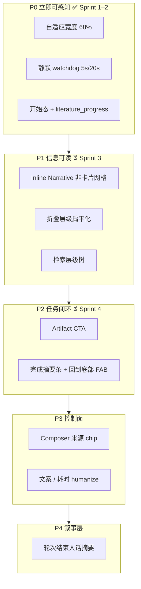

# 会话主窗口体验设计（P0–P4）

面向 `/chat` 主会话区：过程展示、流式反馈、布局宽度。与 Cursor / Claude Code 对比后的改进路线图；**Sprint 1–2 已落地**，Sprint 3–4 待续。

## 定位

| 维度 | LitPilot | Cursor | Claude Code |
|------|----------|--------|-------------|
| 主窗职责 | **过程面板**：Brief → 检索 → 抓取 | 行动面板：改代码 + Review | 对话面板：工具 inline |
| 交付落点 | 右侧 Artifact（综述 / 矩阵） | Diff / Git | 仍在对话流 |
| 信息密度 | 阶段 Workflow + 工具步 | 叙述 + 文件 pill | 气泡 + 可折叠块 |

**保留**：三栏 + 阶段卡片 + 历史 turn 默认折叠。  
**改进**：减少「工程师 trace」感（JSON、多层折叠、长时间静默）。

---

## 现状诊断

### 宽度

旧版 `--litpilot-content-max: min(52rem, 100%)`（≈832px）。1440px 屏、Artifact 关闭时正文仅占主列 ~50%。

### 流式静默

| 静默窗口 | 根因 | 典型时长 |
|---------|------|---------|
| 检索开始前 | 理解阶段 LLM + 整段 search API | 10–60s |
| 多主题并行 | pass 内事件缓冲后批量释放 | 等到最慢 pass |
| 抓取 | 旧逻辑 `yield_begin` 在完成后才发 | 单篇 timeout 内零更新 |
| 综述生成 | 正文进 Artifact，主窗卡片不变 | 1–3 min |
| 前端 | 无 elapsed / silence 提示 | 感知「卡死」 |

---

## 优先级路线图



---

## P0 — 宽度 + 流式及时性（已实现）

### P0-A 自适应主会话宽度

**决策**：Artifact **关闭**时正文占主列 **68%**；Artifact **打开**时正文 **max-width 不变**，右栏挤占两侧留白，正文不明显变窄。

固定侧栏：nav 145px + 会话列 260px = 405px。

| 视口 | 主列可用 | 正文 max（68%） | 开 Artifact 后右栏约 |
|------|---------|----------------|----------------------|
| 1920 | 1515px | **1030px** | ~437px |
| 1440 | 1035px | **704px** | ~299px |
| 1280 | 875px | **595px**（≥42rem 下限） | ~248px |

**实现**：

- CSS：`--litpilot-content-max: min(72rem, max(42rem, calc(var(--litpilot-main-w) * 0.68)))`
- Modifier：`.litpilot-layout--artifact-open` 下 Artifact 用 `clamp(280px, main - content - 32px, 420px)`
- 文件：`frontend/src/styles/meso-platform.css`

### P0-B 静默 watchdog（前端）

**决策**：**5s** 显示等待文案，**20s** 提示「该步骤较慢」。

- 常量：`STREAM_SILENCE_WARN_SEC = 5`，`STREAM_SILENCE_SLOW_SEC = 20`（`streamActivity.ts`）
- Hook：`useStreamActivity` 跟踪 `lastEventAt`，Composer 状态条展示阶段 + 已等待秒数
- 任意 SSE 事件刷新 `lastEventAt`

### P0-C 后端开始态 + heartbeat（已实现）

**决策**：启用 `literature_progress`，间隔 **5s**（`PROGRESS_INTERVAL_SEC`）。

| 事件 | 时机 | 前端 |
|------|------|------|
| `literature_search_plan` | 检索计划 | 主题数、parallel_mode |
| `literature_search_pass_start` | 每 pass API 调用前 | 检索卡片 spinner |
| `literature_search_source_start` / `_done` | multi_academic 分源 | 层级树节点 |
| `literature_search_pass_done` | pass 结束 | 主题级统计 |
| `literature_search_merge` | 去重合并后 | **deduped** = 纳入语料篇数 |
| `literature_fetch_start` | URL 入队 | 抓取 pending 行 |
| `literature_fetch_user_start` | 用户链入队 | 同上，source=upload |
| `literature_progress` | 长阶段 idle ≥5s | Composer + Workflow 卡片 detail |

**后端要点**：

- `literature_progress.py`：`iter_progress_while_pending`、`merge_async_iter_with_progress`
- 理解阶段：`literature_planner.py` 流式理解 + progress merge
- 多主题 multi_academic：`parallel_mode=by_source`（见 [retrieval-fetch.md](./retrieval-fetch.md)）
- 并行 pass（非 multi_academic）：事件实时 queue yield，不再整包 `collected`

---

## P1 — 信息可读（Sprint 3 ✅）

> 执行清单：[sprint-3-checklist.md](./sprint-3-checklist.md)

**已完成**：Inline log 行、流式仅 running 展开、历史 turn 默认全折叠、检索树 + `deduped`、移除 legacy `litpilot-tool-step__*` CSS、`WebFetchStepTitle` 删除。

### 原则：Inline Narrative，非卡片网格

**明确不做**：居中 card 网格、标题+状态重复两行、workflow 套娃。

**目标形态**（Claude Code log 风格）：

```
检索中（2/4）：AI-native MOM reference architecture…
  → 命中 5 篇 · semantic_scholar · 21s
抓取 3/15：Smith et al. — Manufacturing Knowledge Graph…
  → 约 4,200 字
```

JSON / 原始响应仅在「展开详情」二级入口。

### P1-A 工具结果可读化

- `web_search` / `web_fetch`：默认 log 行 + 可选展开
- 去掉主展示 `<pre>` JSON

### P1-B 折叠层级扁平化

当前：`TurnWorkflowBlock` → `WorkflowCardView` → `LitPilotToolStep`（三层）。

- 流式中：仅 **running** 卡片展开；已完成 → 单行摘要（✓ 文献检索 · 47 篇 · 21s）
- 单轮任务去掉 Turn 级总折叠

### P1-C Workflow 展开态一致性

- 折叠 / 展开时 **横向位置不变**：固定宽度前缀槽（✓ / ▸）
- 折叠与展开 **字号、字重一致**（已实现于 `TurnWorkflowBlock` / CSS）

### P1-D 检索层级树

Brief 多子主题 + `multi_academic` 时：

```
检索中（2/4）
├─ 子主题 A          检索中（3/5）
│   ├─ OpenAlex      检索完成（3/8）
│   └─ arXiv         检索中…
└─ 子主题 B …
```

- 实现：`searchProgressTree.ts` + extension 事件
- 主题级篇数取 **`literature_search_pass_done.hits_taken`**；全局纳入篇数取 **`literature_search_merge.deduped`**，禁止对子源 raw 求和

---

## P2 — 任务闭环（Sprint 4 ✅ 基础）

### P2-A Artifact 引导

- `TurnCompletionBar` CTA：「综述已生成 → 打开右侧面板」
- 右栏关闭且有 Artifact：`litpilot-layout--artifact-nudge` 脉冲（4s）

### P2-B 完成态单行摘要

- `TurnCompletionBar.headline`：检索 · 纳入 · 抓取 · 综述已生成

### P2-C 回到底部 FAB

- `LitPilotScrollToBottom` 已接入 `/chat`

---

## P3 — 控制面（✅）

- Composer：**来源模式 chip**（合并检索 / 仅用户列表）
- **流式只读并行度 chip**：`extractStreamParallelism` → `formatParallelismChips` → `LitPilotComposer.streamParallelismChips`（检索 `by_source` / `by_topic`；抓取 `literature_progress.parallel` 或 `in_flight`）
- 状态：Workflow 卡片 running 时显示「进行中」
- 耗时 humanize：`humanizeDurationMs` 内联省略 sub-second（≥1s 才显示）

---

## P4 — 叙事层（✅）

- 轮次结束 **`TurnCompletionBar.brief`**（综述 / 纳入篇数 / 抓取失败）
- **`weak_subtopics`**：`literature_search_merge` 按 pass `hits_taken` 与阈值 `max(3, floor(per_query×0.25))` 标记薄弱子主题；brief 追加 `expand_search` 建议；历史 turn 读 `execution_trace.literatureStats.weakSubtopics`
- `literature_relevance_filter.query_warning` → brief 追加扩检提示
- `query_corpus` 仍用 `ChatBubble` 展示回答正文

---

## 关键模块

| 模块 | 路径 |
|------|------|
| 布局宽度 | `frontend/src/styles/meso-platform.css` |
| 静默 / Composer 状态 | `streamActivity.ts` · `useStreamActivity.ts` · `LitPilotComposer.tsx` |
| 薄弱子主题 | `subtopicWeakHints.ts` · `literature_phases.py` merge |
| Workflow 树 | `turnWorkflow.ts` · `searchProgressTree.ts` · `WorkflowCardView.tsx` |
| Extension 处理 | `literatureExtensionHandlers.ts` |
| 持久化 workflow | `backend/app/agents/turn_workflow.py` · `execution_trace.literatureStats` |
| Progress tick | `backend/app/agents/literature_progress.py` |
| 检索阶段事件 | `backend/app/agents/literature_phases.py` |

## 与 MESO 边界

LitPilot 自研：Workflow 卡片、工具步、Composer 状态、进度树、宽度 override。  
MESO 提供：`ThreeColumnLayout`、`ChatBubble`、`ArtifactPanel`、SSE `StreamState` 解析。

详见 [task-streaming.md](./task-streaming.md)（后台任务与重连）。
