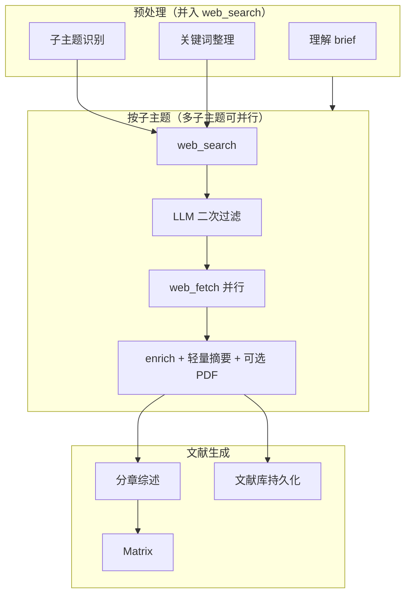
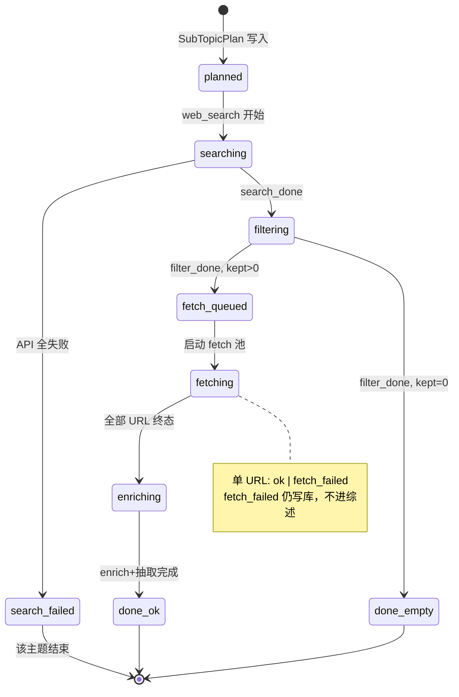

# 文献管线 v2（减法版）

> **状态**：实施中（§1 intent + 数据模型已落地）。取代 [literature-pipeline.md](./literature-pipeline.md)、[retrieval-fetch.md](./retrieval-fetch.md)、[multi-turn-refine.md](./multi-turn-refine.md) 中的编排语义；基础设施文档（[overview.md](./overview.md)、[task-streaming.md](./task-streaming.md)）继续有效。

## 设计原则

1. **三个子流程**：`web_search` → `web_fetch` → `文献生成`（含 Matrix）。
2. **子主题是唯一结构单元**：大纲 = 子主题列表；分章写作 = 每子主题一章；文献用 **标签** 挂载多子主题。
3. **显式意图**：子主题增改只响应用户明确表述；其余走短答并提示话术。
4. **能删则删**：合并 intent、去掉并行 search/fetch、去掉 outline 三态与独立 attributes 阶段。

---

## 总览



### 与 v1 的核心差异

| 维度 | v1 | v2 |
|------|----|----|
| search / fetch | `FetchCoordinator` 与 search 并行 | **子主题 filter 完成后**才启动该主题 fetch |
| 相关性筛选 | 全局 merge 后一次 | **每子主题 search 完成后** |
| 写作路径 | outline off / lite / full 三轨 | **仅**「子主题 = 章节」分章写 |
| 意图 | 10 种 | **5 种**（见下表） |
| SSE | 15+ extension | **6 类**核心事件 + 标准 Meso 事件 |
| 结构化 | 独立 `attributes` 阶段 | **enrich 时轻量抽取**（见 §结构化字段） |

---

## 意图路由（5 种）

| intent | 触发条件（须显式） | 子流程 | 综述版本 |
|--------|-------------------|--------|----------|
| `new_topic` | 首轮或无 corpus | 全量子主题：search → filter → fetch → enrich → 生成 | 新编号 `v1`, `v2`, … |
| `subtopic_change` | 用户明确「增加/修改子主题：…」 | **仅变化子主题**完整 search → filter → fetch → enrich；未变子主题语料复用 | 默认局部章替换；用户说「整篇重写」→ 新编号 |
| `append_urls` | 多轮用户追加 URL（Composer「+」或消息内链接） | 不 search；URL **立即并行 fetch** → enrich → LLM **打 subtopic_tags** | **不自动改综述**；短答列出已更新文献库/语料条目，并提示「可根据新文献更新第 X 章」 |
| `review_refine` | 用户明确改写法/改某章，**不涉及**子主题与 URL | 不 search/fetch；基于已有语料 + 约束改旧版 | **同编号 + 字母** `v3`→`v3a`→`v3b`（a–z，用尽则 `v3aa`） |
| `query_corpus` | 问句、核实、对比等（**非**上述四类） | 不 search/fetch；短答 | 无 |

### 子主题 diff 规则（硬规则）

- **进入 `subtopic_change`**：消息须匹配显式模式，例如：
  - 「增加子主题」「加一个子主题」「新增子主题：…」
  - 「修改子主题」「把子主题 X 改成…」「更新子主题：…」
- **其他一切**（含「再多找几篇 trust 的文献」）→ `query_corpus`，短答末尾固定附：
  > 若要**增加或修改子主题**，请明确说明，例如：「增加子主题：零信任架构」或「修改子主题 2：改为 …」。

实现：`literature_intent.py` 规则优先于 LLM；LLM 仅辅助解析子主题编号/名称。

### 局部重生成范围

| 用户表述 | 行为 |
|----------|------|
| 未提「整篇/全文/全部重写」 | 只重写 **命中子主题对应章节**，从 `review-latest` 切分替换或追加 |
| 「整篇重写」「全文重新生成」 | `new_topic` 级全章重跑或 `subtopic_change` 后全章重跑，版本 **新编号** |
| `review_refine` + 「只改第二章」 | 仅该章 revise，其余章原文复用 |

章节与子主题 **1:1**（预处理时确定顺序）；`outline.json` 退化为 `{ subtopics: [{ id, title, search_query, chapter_id }] }`。

### 删除的 v1 intent

| v1 intent | v2 处置 |
|-----------|---------|
| `expand_search` | 并入 `subtopic_change`（须显式改子主题）或 `query_corpus` 引导 |
| `supplement` | 并入 `append_urls` |
| `refine_gen` / `regen_only` | 合并为 `review_refine`（`gen_constraints` 仍累积） |
| `retry_failed` | 文献库条目操作「重新抓取」，非聊天 intent |
| `manage_library` | 文献库 UI + 单次指令，非 intent |
| `synthesis_matrix` | 首轮生成子步骤，非独立 intent |
| `defer_generate` | 删除；`append_urls` 天然只更新语料 |

---

## 子流程 1：web_search

### 预处理（单次 / 每轮 subtopic_change 对变化主题）

1. **理解 brief**（`orchestrator` 单次流式，合并原 router + planner A）。
2. **子主题识别**：规则 + LLM，输出 `SubTopicPlan`。
3. **关键词整理**：每子主题一条 `search_query`（合并原 `search_query_refiner`；**删除** `enable_query_expansion` 独立开关）。

### 并行策略

- 多子主题：**各子主题独立** search 任务（asyncio 或线程池）。
- `search_provider=multi_academic`：子主题内五源并行，**同源全局串行**（保留 `source_gate.py`，不暴露 `parallel_mode` 配置）。
- `search_max_results`：**全局预算**，按子主题数均分 `per_subtopic_cap = max(2, budget // n)`，合并去重后 ≤ budget。

### 每子主题：search → filter

```
search_done(subtopic_id) → LLM relevance_filter(该主题命中列表) → filter_done(subtopic_id, kept[])
```

- 剔除项不进入 fetch，可记入 trace 统计。
- 子主题间 URL 去重：同一 URL **保留首次出现的子主题标签**，后续主题若命中同一 URL 则 **追加标签** 而非重复 fetch。

### search 零命中

- **直接结束该子主题**（`filter_done` kept=0），不暂停、不门禁。
- 回合继续：其他子主题照常；若全部零命中 → 不进入生成，短答说明「本轮未纳入文献，请下轮用 subtopic_change 调整检索式」。

### 删除的能力

- `literature_clarification` 的 `search_zero` / `outline_confirm` / `first_turn`（首轮 brief 过短可保留 **可选** 一句追问，不写入 `pending_gate`）。
- `plan_confirm` / `resume_mode=generate_only`。
- `literature_source_mode=user_only`（首轮不做 URL；见 §用户 URL）。

---

## 子流程 2：web_fetch

### 触发时机

**每个子主题 `filter_done` 之后**，为该主题 `kept[]` 启动 fetch 线程池（与 search **不并行**）。

例外：`append_urls` 在路由后立即 fetch，不经过 search。

### 单篇流水线

```
web_fetch → content 压缩 → enrich(Crossref/OpenAlex) → 轻量字段抽取 → 可选 PDF
```

| 步骤 | 说明 |
|------|------|
| web_fetch | `fetch_parallel` 限流；超时/失败见 §失败策略 |
| enrich | 有 DOI → Crossref；无 DOI → OpenAlex 反查 → Crossref |
| 轻量抽取 | 见 §结构化字段 |
| PDF | 有 DOI / arXiv / OA 链接时尝试下载；**失败静默**；文献库元数据页用图标表示是否有源文件 |

### 失败策略

- fetch 失败：**不进入综述引用**，文献库仍写入 **元数据行**（状态 `fetch_failed`，保留 URL、标题 snippet、失败原因）。
- 用户可在文献库补 DOI/标题后点 **「重新抓取」**（单条 API，非聊天 intent）。

### 用户 URL（`append_urls`）

| 轮次 | 行为 |
|------|------|
| 首轮 `new_topic` | Composer **「+」禁用**（`uploadDisabled`）；后端忽略 `fetch_urls`；**无**配置开关 |
| 多轮 | `append_urls`：URL **立即并行 fetch** → enrich → LLM 打 `subtopic_tags` |

回合结束短答（`chat` 交付）须包含：

1. **已更新文档**：列出新纳入/更新的文献库条目（标题或 display_index）。
2. **引导语**：「可根据新文献更新第 X 章」——若 LLM 已打标签，给出建议章节号；否则提示用户指定章节。

不自动触发 `review_refine` 或综述版本递增。

### 跨子主题：标签与配额

- 文献实体键：`canonical_url` / DOI。
- `subtopic_tags: string[]`：一篇文献可挂多个子主题。
- `max_fetch_urls`：**全局**抓取上限（硬顶 50）；按子主题 filter 后 **FIFO 入队**，满额后剩余标记 `queued_skipped`（仅元数据+检索 snippet，不进综述）。

---

## 结构化字段（建议）

### 结论：**删除独立 `attributes` 阶段**；在 enrich 后做 **轻量同步抽取**

| 方案 | 做法 |
|------|------|
| 保留什么 | fetch 成功后，用 **一次短 LLM 或规则** 抽 3 列供 Matrix / mount：`method_one_liner`、`findings_one_liner`、`year`（有则填） |
| 写作用什么 | `content_pipeline` 压缩后的正文块 + 书目标注；**不再**单独跑 AttributeTree |
| 原因 | ① 独立 attributes 阶段多一轮 LLM、阻塞生成；② 综述 LLM 可直接读正文；③ Matrix 仍需列，轻量抽取即可；④ 失败时 Matrix 列显示「—」，不阻断 |

### 删除

- `enable_paper_attributes` 开关（或固定为 enrich 内嵌，管理员不可关）。
- `stream_attributes_phase`、`paper_attributes.py` 独立阶段 UI。

---

## 子流程 3：文献生成

### 输入

- `corpus.json`：`papers[]` 含 `subtopic_tags`、正文摘要、书目标、enrich 字段、`has_pdf`。
- `outline.json`：子主题 ↔ 章节映射。

### 步骤

1. **mount**：按 `subtopic_tags` 将文献挂到章节（一篇可进多章材料池）。
2. **分章写作**：每子主题一章，`stream_section_generate` → `stitch_review_sections`。
3. **Matrix**：基于轻量字段 + 书目标生成 `literature-matrix+markdown` artifact（与综述同轮）。
4. **deliver**：`review-latest.md` + 版本元数据。

### 版本策略

| 操作 | `review_versions[]` 记录 |
|------|-------------------------|
| 首轮 / 整篇重写 | `{ id: "v4", kind: "full", parent: null }` |
| `review_refine` | `{ id: "v3a", kind: "refine", parent: "v3" }` |
| `subtopic_change` 局部章替换 | `{ id: "v3b", kind: "partial", parent: "v3", chapters: ["st2"] }` |

文件：`artifacts/{session}/review-v3a.md`；`review-latest.md` 始终指向当前指针。

### 删除

- `outline_mode` off / lite / full。
- `post_refine_mode` 独立阶段（套话/缺节检测并入生成 system prompt 或一次性规则函数，**默认关**）。
- `section_refine` 与 `regen_only` 分支（由 `review_refine` + 章节解析替代）。
- `workflow-graph` 动态章节 DAG artifact（UI 已不展示）。

---

## 按子主题状态机



### 回合级聚合

所有子主题 ∈ `{ done_ok, done_empty, search_failed }` 后：

- 若至少一篇 `fetch_ok` → 进入 **文献生成**。
- 若零篇可引用 → 结束回合，短答（无澄清门禁）。

`append_urls` 无 `planned→searching`；URL 列表直接进入 `fetching → enriching`。

---

## SSE 事件清单（v2）

### 保留：Meso 标准

`stage`、`think`、`text`、`artifact`、`tool_call`、`workflow_node`、`done`

### 收敛：LitPilot extension

| 事件 | 时机 | 载荷要点 |
|------|------|----------|
| `literature_intent` | 路由完成 | `intent`, `subtopic_ops?` |
| `literature_subtopic_plan` | 预处理完成 | `subtopics: [{ id, title, query }]` |
| `literature_subtopic_search_done` | 单主题 search 结束 | `subtopic_id`, `raw_count`, `duration_ms` |
| `literature_subtopic_filter_done` | 单主题过滤结束 | `subtopic_id`, `kept_count`, `kept_urls[]` |
| `literature_subtopic_fetch_done` | 单主题 fetch 全部终态 | `subtopic_id`, `ok`, `failed`, `skipped` |
| `literature_generate_done` | 综述+Matrix 交付前 | `version_id`, `chapter_count` |

### 可选（实现期二选一）

- `literature_progress`：长阶段 heartbeat（5s），**保留**（对 UX 仍有价值）。
- 单 URL 进度：并入 `tool_call` `web_search` / `web_fetch`，**不再**发 `literature_search_pass_*` / `literature_search_source_*` / `literature_fetch_user_start` 等。

### 删除的 extension

`literature_search_plan`, `literature_search_pass_start`, `literature_search_pass_done`, `literature_search_merge`, `literature_search_source_start`, `literature_search_source_done`, `literature_relevance_filter`, `literature_fetch_user_start`, `literature_fetch_start`, `literature_outline`, `literature_section_refine`, `literature_refine_report`, `literature_clarification`（或仅保留极简 `literature_notice` 非阻塞提示）。

### 前端树

`searchProgressTree.ts` 改为 **子主题为根** 的三段：`检索 → 过滤 → 抓取`；`turn_workflow` phase 收敛为：`understand` | `search` | `fetch` | `generate` | `corpus_qa`。

---

## 产出物

| 产出 | 路径 | 说明 |
|------|------|------|
| 文献库 | `refs/library.json` + 条目 `subtopic_tags` | fetch 失败亦有行 |
| 语料 | `sessions/{id}/corpus.json` | 与库同步索引 |
| 子主题计划 | `sessions/{id}/outline.json` | 简化 schema |
| 综述 | `artifacts/.../review-{version}.md`, `review-latest.md` | 版本化 |
| Matrix | artifact `literature-matrix+markdown` | 每轮 full 生成时更新 |
| PDF | `sessions/{id}/papers/{paper_id}.pdf` | 可选，库中 `has_pdf` |

---

## 配置项（v2 收敛）

### web_search 能力卡

| 参数 | 默认 | 硬顶 | 说明 |
|------|------|------|------|
| `search_provider` | `multi_academic` | — | 保留 |
| `search_max_results` | 40 | 80 | **全局**合并上限 |
| `search_retry_count` | 1 | 3 | |
| `include_domains` / `exclude_domains` | 现默认 | — | |
| `search_depth` | advanced | — | |
| `enable_junk_filter` | true | — | |

**删除**：`enable_query_expansion`, `expansion_count`, `search_parallel`（内部按子主题数自动）、`literature_source_mode`, `merge_search_budget`（合并进 `search_max_results` 语义）。

### web_fetch 能力卡

| 参数 | 默认 | 硬顶 | 说明 |
|------|------|------|------|
| `fetch_provider` | `native` | — | |
| `max_fetch_urls` | 15 | 50 | 全局队列 |
| `fetch_parallel` | 3 | 8 | |
| `fetch_timeout_sec` | 45 | 120 | |
| `max_source_chars` | 14000 | 50000 | |

### prompts 页

**删除**：`outline_mode`, `post_refine_mode`, `enable_paper_attributes`。

**保留**：`review_system_prompt_template`, `matrix_system_prompt`（若有）。

### 个人设置

**删除**：`plan_confirm`。

**保留**：`citation_format`。

### orchestrator

**删除**：`orchestrator_mode=full` 与检查点 B–G。

**保留**：`use_llm_planner`（理解+子主题一次流式），`orchestrator_mode=lite` 或降为固定 on。

---

## 模块映射

### 保留并改造

| 模块 | v2 职责 |
|------|---------|
| `literature_turn.py` | 回合入口；5 intent 分支 |
| `literature_intent.py` | 规则路由 + 显式子主题/URL 检测 |
| `literature_turn_pipeline.py` | 按子主题状态机驱动 search→filter→fetch |
| `literature_phases.py` | 拆出 per-subtopic 阶段函数；删 attributes/outline 阶段 |
| `relevance_filter.py` | **按子主题**调用 |
| `fetch_coordinator.py` | **仅** `append_urls` 与用户重试；删除 search 并行入队 |
| `parallel_fetch.py` / `source_gate.py` | fetch / multi_academic 限流 |
| `literature_turn_generate.py` | 分章写 + Matrix；`review_refine` 局部章 |
| `literature_section_writer.py` | 分章流式 |
| `section_refine.py` | 并入 `review_refine` 章节解析 |
| `research_decompose.py` | 子主题识别 |
| `search_query_refiner.py` | 并入预处理关键词 |
| `literature_turn_finalize.py` | 版本号、library、corpus 写入 |
| `literature_tasks.py` / `task_store.py` | 不变 |
| `turn_workflow.py` | 5 phase 卡片 |
| `execution_trace.py` | 简化 stats 字段 |

### 删除或废弃

| 模块 / 文件 | 原因 |
|-------------|------|
| `search_expansion.py` | 并入预处理 |
| `literature_clarification.py` 门禁流 | 零命中不暂停 |
| `literature_outline.py` mount 复杂逻辑 | 改为 tag mount |
| `literature_post_refine.py` | 删除或内联一条规则 |
| `fetch_coordinator` search 增量入队 | 拓扑变更 |
| `literature_turn_graph.py` 动态 section 图 | 简化 workflow |
| `workflow_graph.py` section_specs 展开 | 固定 4 节点 |
| `paper_attributes.py` 独立阶段 | enrich 轻量抽取 |
| `first_turn_assessor.py` | 可选保留极简提示，非 gate |
| `stream_expanded_search_phase` | 删除 |

### 前端

| 路径 | 变更 |
|------|------|
| `searchProgressTree.ts` | 子主题三段树 |
| `literatureExtensionHandlers.ts` | 6 个 extension |
| `turnWorkflow.ts` | 5 phase |
| `literatureIntent.ts` | 5 intent 文案 |
| `settings/admin/capabilities/page.tsx` | 删 expansion / parallel / source_mode |
| `settings/admin/prompts/page.tsx` | 删 outline / post_refine / attributes |
| `settings/personal/page.tsx` | 删 plan_confirm |
| `help/pages.ts` | 对齐 v2 话术 |

---

## 实施顺序（建议）

1. **数据模型**：`corpus.json` / `library.json` 增加 `subtopic_tags`、`fetch_status`、`has_pdf`；`review_versions` 字母后缀。
2. **intent 收敛**：5 路由 + query_corpus 引导文案。
3. **pipeline 拓扑**：per-subtopic 状态机；拆掉 search/fetch 并行。
4. **SSE + 前端树**：6 extension；删旧 handler。
5. **生成简化**：单一路径分章；版本策略。
6. **配置页减法**：capabilities / prompts / personal。
7. **文档**：将 v1 三 doc 标为 deprecated，指向本文。

---

## 附录：query_corpus 引导模板

短答末尾追加（可配置一行）：

> 如需**增加或修改子主题**，请明确说明，例如：「增加子主题：零信任」或「修改子主题 2：…」。如需**追加文献链接**，请粘贴 URL 或点击「+」上传。如需**只改综述表述**，请说明章节与修改要求。

---

## 附录：与 v1 文档关系

| 文档 | 状态 |
|------|------|
| `literature-pipeline-v2.md`（本文） | **当前目标** |
| `literature-pipeline.md` | deprecated → 实现完成后归档 |
| `retrieval-fetch.md` | deprecated（并行/FetchCoordinator 语义作废） |
| `multi-turn-refine.md` | deprecated（intent 表以本文为准） |
| `literature-workflow.md` | 待同步精简版用户向说明 |
